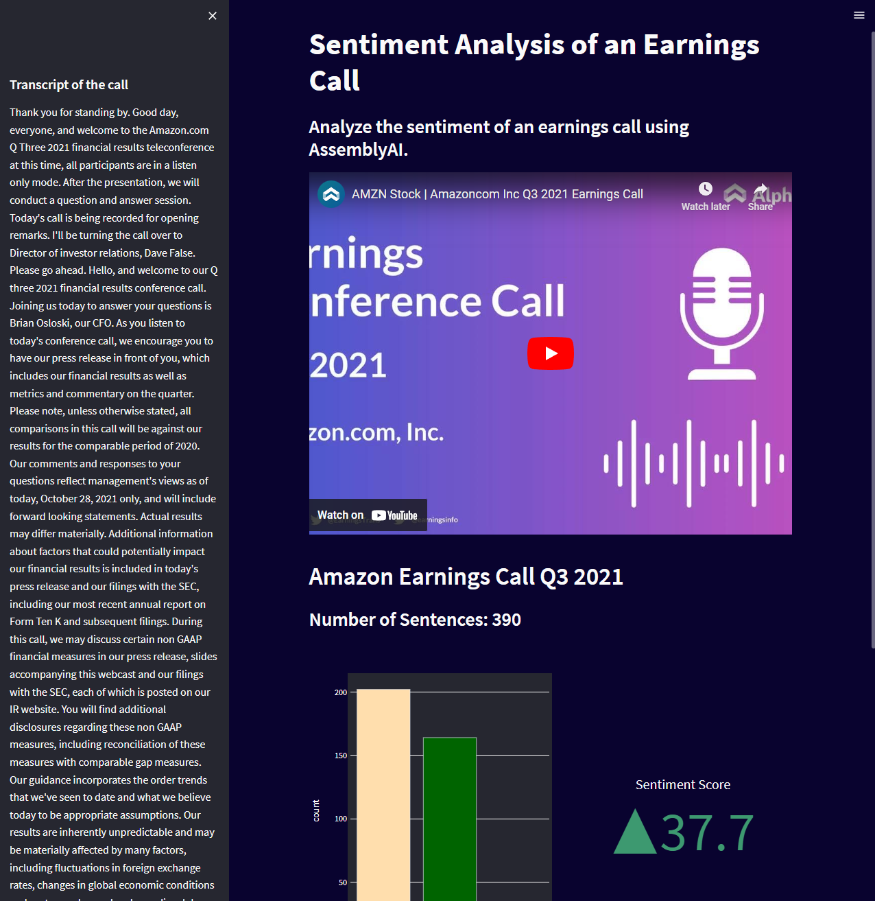

# Sentiment Analysis of an Earnings Call

This application shows an example of how you can use AssemblyAI's [Sentiment Analysis](https://www.assemblyai.com/blog/introducing-sentiment-analysis/) model to identify and visually display information on the sentiments expressed in a corporate earnings call.

To follow along step-by-step, check out [this YouTube tutorial](https://youtu.be/kBoe56CfugY) to learn how to build an expanded version of this application that will allow you to perform similar Sentiment Analysis on your audio files.

## Quick Setup

* Download project files by running `git clone https://github.com/AssemblyAI/sentiment-analysis-on-earnings-call`
* Navigate to the project folder
* Create a new [virtual environment](https://docs.python.org/3/library/venv.html)
* Activate the new virtual environment and run `pip install -r requirements.txt` to install project dependencies
* Run the application using the `streamlit run app.py`

## How it Works

The application works by taking data from a JSON file that was created by submitting an audio file to the AssemblyAI Transcription API for with `sentiment_analysis` set to `true`. That data is used to create visualizations like the number of sentences identified with each sentiment, an indicator showing where each sentiment occurred in the audio file, and an overall Sentiment Score for the call.

## Main Dependencies

* [Streamlit](https://pypi.org/project/streamlit/) The fastest way to build data apps in Python
* [Pandas](https://pypi.org/project/pandas/) Powerful data structures for data analysis, time series, and statistics
* [Plotly](https://pypi.org/project/plotly/) An open-source, interactive data visualization library for Python

Contact Us
--
If you have any questions, please feel free to reach out to our Support team - support@assemblyai.com!
